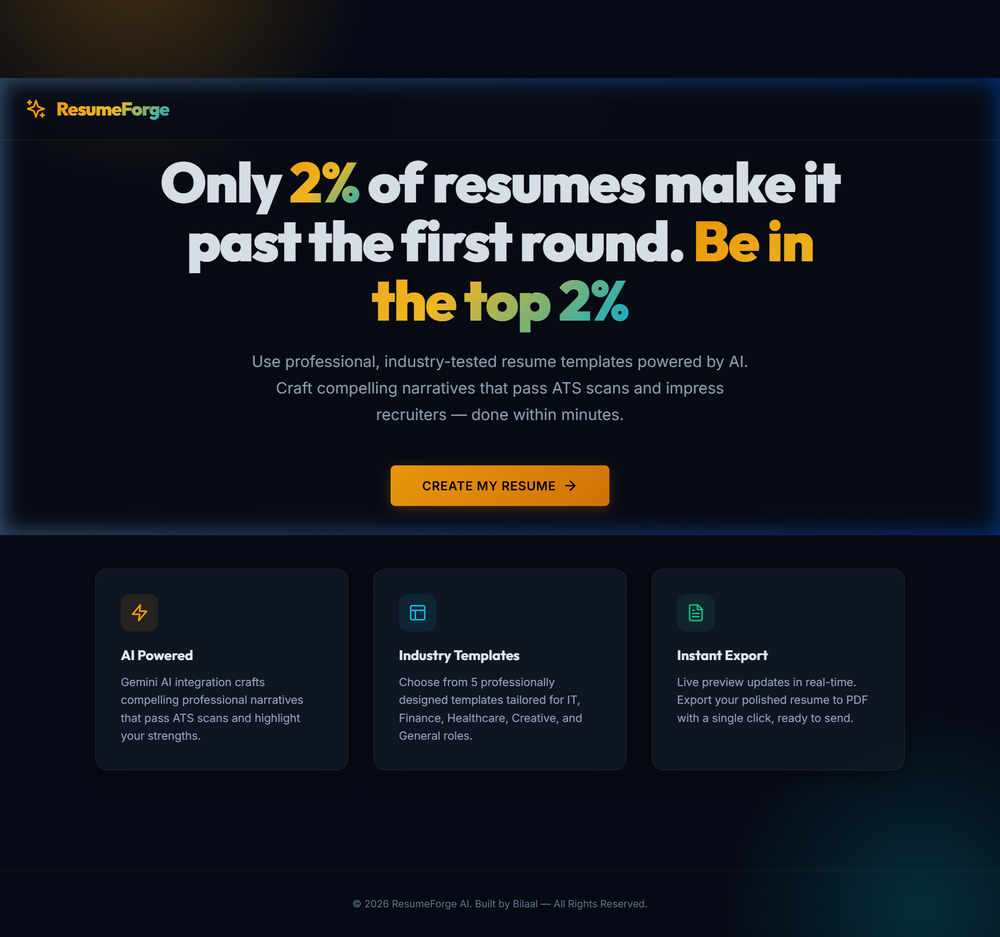
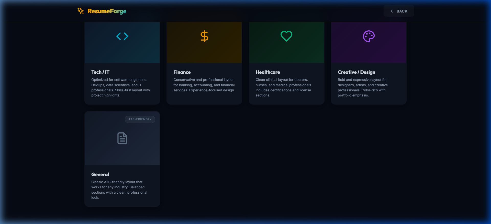
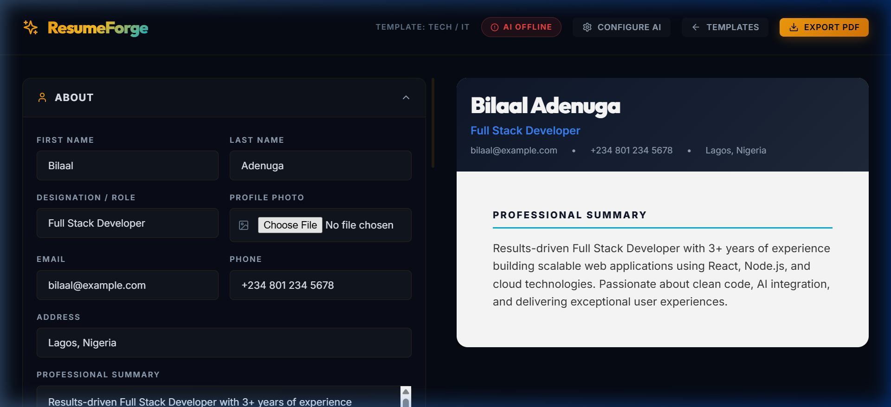
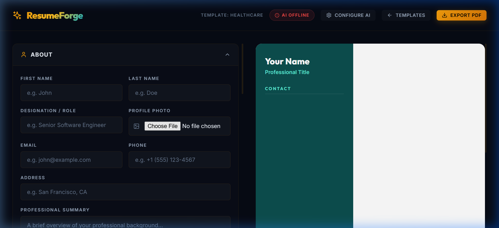
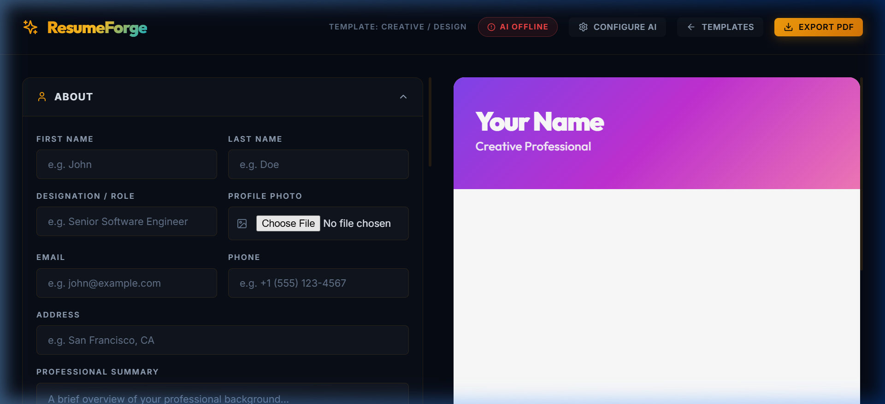

# ✨ ResumeForge AI

> **AI-Powered Resume Builder** — Craft professional, ATS-optimized resumes in minutes with Google Gemini AI and industry-specific templates.



---

## 🚀 Features

### 🤖 AI-Powered Content Generation
Powered by **Google Gemini AI** (free tier), ResumeForge intelligently crafts and enhances your resume content:

- **AI Summary Generator** — Automatically creates a professional summary tailored to your industry, role, and experience
- **Resume Tailor** — Paste any job description and AI rewrites your summary to match the role's requirements
- **Bullet Power-Up** — Transforms simple task descriptions into quantified, impactful achievement statements
- **AI Skills Enhancer** — Organizes and refines your raw skills list for maximum ATS impact

### 📋 5 Industry-Specific Templates

Each template is professionally designed with tailored section ordering, color schemes, and typography:

| Template | Best For | Key Features |
|----------|----------|-------------|
| **Tech / IT** | Software Engineers, Data Scientists, DevOps | Skills-first layout, tech skill badges, project highlights |
| **Finance** | Banking, Accounting, Financial Services | Conservative serif styling, experience-focused, gold accents |
| **Healthcare** | Doctors, Nurses, Medical Professionals | Two-column sidebar, certifications section, teal clinical theme |
| **Creative / Design** | Designers, Artists, Creative Professionals | Bold gradient header, portfolio grid, timeline-style entries |
| **General** | Any Industry | Classic ATS-friendly layout, balanced sections, blue professional theme |



### 📝 Comprehensive Resume Builder

- **Multi-section form** — About, Experience, Education, Projects, Skills, Achievements
- **Dynamic entries** — Add/remove unlimited experience, education, project, and achievement entries
- **Live preview** — See your resume update in real-time as you type
- **Profile photo upload** — Add a professional headshot directly
- **Collapsible sections** — Clean, organized form interface



### 🎨 Premium Design System

- Dark glassmorphism UI with smooth animations
- Gradient text effects and glass card components
- Fully responsive across desktop, tablet, and mobile
- Print-optimized CSS for clean PDF exports

### 📄 Instant PDF Export

Click **"Export PDF"** to generate a clean, print-ready resume — no watermarks, no sign-up required.

---

## 🏥 Template Previews

### Healthcare Template


### Creative / Design Template


---

## 🛠️ Tech Stack

| Technology | Purpose |
|-----------|---------|
| **React 18** | UI framework |
| **Vite** | Build tool & dev server |
| **React Router** | Client-side routing |
| **Framer Motion** | Animations |
| **Lucide React** | Icon library |
| **Google Gemini AI** | AI content generation |
| **Vanilla CSS** | Custom design system |

---

## 📦 Getting Started

### Prerequisites
- **Node.js** 18+ installed
- A [Google Gemini API key](https://aistudio.google.com/apikey) (free)

### Installation

```bash
# Clone the repository
git clone https://github.com/Bilaaladenuga/ResumeForge-AI.git
cd ResumeForge-AI/client

# Install dependencies
npm install

# Start the development server
npm run dev
```

Open **http://localhost:3000** in your browser.

### Setting Up AI Features

1. Get a free API key from [Google AI Studio](https://aistudio.google.com/apikey)
2. Click **"Configure AI"** in the app navbar
3. Paste your API key and click **Save**
4. Your key is stored locally in your browser — never sent to any third-party server

---

## 📁 Project Structure

```
client/
├── src/
│   ├── components/
│   │   ├── LandingPage.jsx       # Hero page with feature cards
│   │   ├── TemplateSelector.jsx  # Industry template picker
│   │   ├── ResumeBuilder.jsx     # Main builder orchestrator
│   │   ├── ResumeForm.jsx        # Multi-section form
│   │   ├── ResumePreview.jsx     # Dynamic template renderer
│   │   ├── AIPanel.jsx           # AI features panel
│   │   └── SettingsModal.jsx     # API key configuration
│   ├── templates/
│   │   ├── index.js              # Template registry
│   │   ├── TechTemplate.jsx      # Tech/IT layout
│   │   ├── FinanceTemplate.jsx   # Finance layout
│   │   ├── HealthcareTemplate.jsx# Healthcare layout
│   │   ├── CreativeTemplate.jsx  # Creative layout
│   │   └── GeneralTemplate.jsx   # General/ATS layout
│   ├── services/
│   │   └── ai.js                 # Gemini API integration
│   ├── styles/
│   │   └── templates.css         # Template-specific styles
│   ├── index.css                 # Global design system
│   ├── App.jsx                   # Router & routes
│   └── main.jsx                  # Entry point
├── index.html
├── package.json
└── vite.config.js
```

---

## 👨‍💻 Author

**Bilaal Adenuga**

---

## 📄 License

This project is open source and available under the [MIT License](LICENSE).
